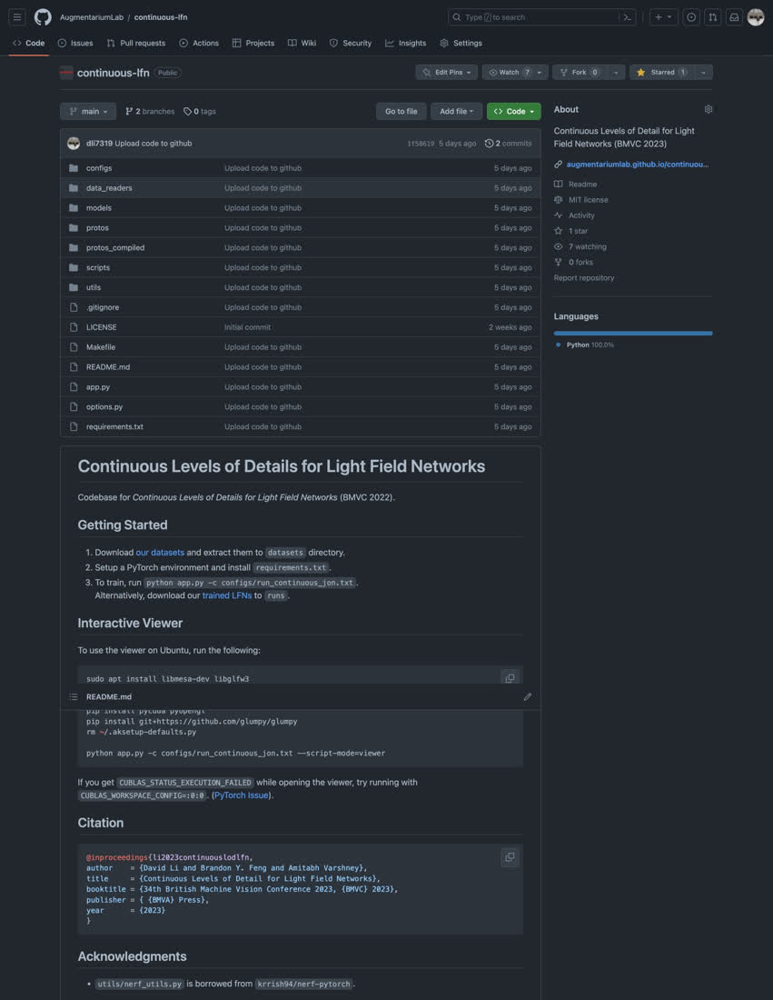

<style>
@media screen and (min-width: 64em) {
.main-content {
    max-width: 70rem;
}
}
.page-header{
background-color: #086375;
background-image: linear-gradient(120deg, #9E5F7D, #A67794);
}
.erp_image {
    width: 12.4rem;
    object-fit: fill;
}
.main-content table {
  width: fit-content;
  margin: auto;
}
.main-content table th, .main-content table td {
    padding: 0;
}
.table_header td {
  text-align: center;
}
.comparison_table {
  border: 1px solid;
}

.main-content h2,
.main-content h3 {
  color: #78375F;
}

.main-content
.table_cell_video {
  max-width: 20rem;
  max-height: 25rem;
}

.table_cell_video2 {
  max-width: 24rem;
  max-height: 25rem;
}

.text-center {
  text-align: center;
}
</style>

<!-- <iframe width="560" height="315" src="https://www.youtube.com/embed/TAK7KavGivo" frameborder="0" allow="accelerometer; autoplay; clipboard-write; encrypted-media; gyroscope; picture-in-picture" allowfullscreen style="max-width: 100%; position: relative; left: 50%; transform: translateX(-50%);"></iframe> -->

## Abstract

[](#)

Recently, several approaches have emerged for generating neural representations with multiple levels of detail (LODs). LODs can improve the rendering by using lower resolutions and smaller model sizes when appropriate. However, existing methods generally focus on a few discrete LODs which suffer from aliasing and flicker artifacts as details are changed and limit their granularity for adapting to resource limitations. In this paper, we propose a method to encode light field networks with continuous LODs, allowing for finely tuned adaptations to rendering conditions. Our training procedure uses summed-area table filtering allowing efficient and continuous filtering at various LODs. Furthermore, we use saliency-based importance sampling which enables our light field networks to distribute their capacity, particularly limited at lower LODs, towards representing the details viewers are most likely to focus on. Incorporating continuous LODs into neural representations enables progressive streaming of neural representations, decreasing the latency and resource utilization for rendering.

## Downloads
(coming soon)

<div style="display: flex; text-align:center; flex-direction: row; flex-wrap: wrap;">
<div style="margin:1rem; flex-grow: 1;"><a href="#"><br>Paper</a><br></div>
<div style="margin:1rem; flex-grow: 1;"><a href="#"><br>Supplementary</a></div>
<div style="margin:1rem; flex-grow: 1;"><a href="https://github.com/AugmentariumLab/continuous-lfn"><br>Code</a></div>
</div>


## Rendered Examples

### Discrete-scale LFN
<div class='container'>
    With only four levels of detail, transitions between levels of detail involve larger jumps and require streaming in larger model deltas.
    <!-- Flexbox version of the above table -->
    <div class="text-center">
      
      
      <br>
      
      
    </div>
</div>

### Continuous LOD LFN
<div class='container'>
  With continous LODs, transitions between levels of detail are gradual and only require streaming an additional row and column of weights per layer.<br>
  The following examples were rendered using our light field network with continuous levels of detail.<br>
  The first column shows transitions across levels of detail from a fixed viewpoint<br>
  The second column shows renders first at the highest level of detail and then at varying lower levels of detail.
  <table class="table text-center table-bordered comparison-table" cellspacing="3">
    <thead>
      <tr>
        <td class="table_header">Fixed Camera Transition</td>
        <td class="table_header">Camera Loop + Transition</td>
      </tr>
    </thead>
    <tbody>
      <tr>
        <td>
          <video class="table_cell_video" width="100%" height="100%" autoplay muted loop>
            <source src="resources/videos/transitions/datasetA.mp4" type="video/mp4">
          </video>
        </td>
        <td>
          <video class="table_cell_video2" width="100%" height="100%" autoplay muted loop>
            <source src="resources/videos/loop_transition/datasetA.mp4" type="video/mp4">
          </video>
        </td>
      </tr>
      <tr>
        <td>
          <video class="table_cell_video" width="100%" height="100%" autoplay muted loop>
            <source src="resources/videos/transitions/datasetB.mp4" type="video/mp4">
          </video>
        </td>
        <td>
          <video class="table_cell_video2" width="100%" height="100%" autoplay muted loop>
            <source src="resources/videos/loop_transition/datasetB.mp4" type="video/mp4">
          </video>
        </td>
      </tr>
      <tr>
        <td>
          <video class="table_cell_video" width="100%" height="100%" autoplay muted loop>
            <source src="resources/videos/transitions/datasetC.mp4" type="video/mp4">
          </video>
        </td>
        <td>
          <video class="table_cell_video2" width="100%" height="100%" autoplay muted loop>
            <source src="resources/videos/loop_transition/datasetC.mp4" type="video/mp4">
          </video>
        </td>
      </tr>
      <tr>
        <td>
          <video class="table_cell_video" width="100%" height="100%" autoplay muted loop>
            <source src="resources/videos/transitions/datasetD.mp4" type="video/mp4">
          </video>
        </td>
        <td>
          <video class="table_cell_video2" width="100%" height="100%" autoplay muted loop>
            <source src="resources/videos/loop_transition/datasetD.mp4" type="video/mp4">
          </video>
        </td>
      </tr>
      <tr>
        <td>
          <video class="table_cell_video" width="100%" height="100%" autoplay muted loop>
            <source src="resources/videos/transitions/datasetE.mp4" type="video/mp4">
          </video>
        </td>
        <td>
          <video class="table_cell_video2" width="100%" height="100%" autoplay muted loop>
            <source src="resources/videos/loop_transition/datasetE.mp4" type="video/mp4">
          </video>
        </td>
      </tr>
    </tbody>
  </table>
</div>

## Citation
```bibtex
@inproceedings{li2023continuouslodlfn,
author    = {David Li and Brandon Y. Feng and Amitabh Varshney},
title     = {Continuous Levels of Detail for Light Field Networks},
booktitle = {34th British Machine Vision Conference 2023, {BMVC} 2023},
publisher = { {BMVA} Press},
year      = {2023}
}
```

David Li, Brandon Y. Feng, and Amitabh Varshney. Continuous Levels of Detail for Light Field Networks. In 34th British Machine Vision Conference 2023 (BMVC 2023)
